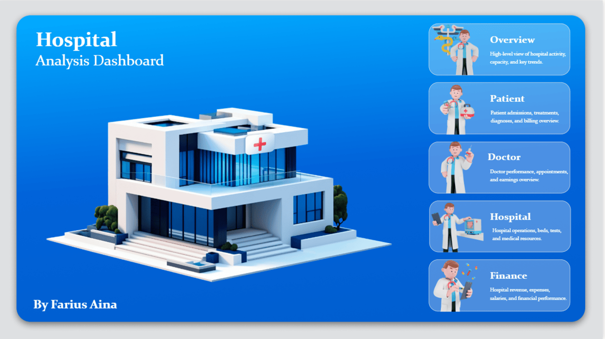

# Hospital Performance Dashboard

Interactive Power BI dashboard designed to support operational and financial decision-making in a healthcare environment.

---

## Business Context

Hospitals require structured visibility over:

- Patient flow
- Capacity utilization
- Resource allocation
- Financial performance

This dashboard centralizes key performance indicators to support data-driven decisions.

---

## Key KPIs

- Admissions & Discharges
- Bed Occupancy Rate
- Average Length of Stay
- Revenue & Cost Monitoring
- Department-Level Performance

---

## Analytical Approach

- Cleaned and structured dataset
- KPI definition before visualization
- Logical page segmentation (Operational / Financial)
- Drill-down capability for granular insights

---

## Dashboard Preview

---

## Tools Used

- Power BI
- Data Modeling
- DAX Measures
- KPI Framework Design

---

## Value Delivered

This dashboard demonstrates the ability to:

- Translate operational needs into measurable KPIs
- Structure multi-layer dashboards
- Deliver decision-ready visualizations
- Maintain clarity and business alignment

---

Part of the broader Data Analytics & Decision Support portfolio.