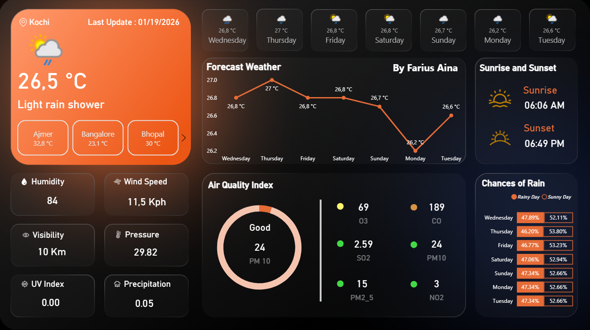

# Weather & Environmental Monitoring Dashboard

Power BI dashboard designed for short-term environmental monitoring and structured indicator tracking.

---

## Business Context

Environmental and climate data require:

- Trend monitoring
- Clear metric comparison
- Time-series visibility
- Simplified decision visualization

This dashboard focuses on structured metric tracking rather than decorative visualization.

---

## Key Metrics

- Temperature Trends
- Forecast Monitoring
- Air Quality Indicators
- Regional Comparisons

---

## Analytical Approach

- Time-series modeling
- Structured metric layering
- Clean filtering logic
- Visual hierarchy for clarity

---

## Dashboard Preview

---

## Tools Used

- Power BI
- Data Modeling
- Time-Series Analysis
- KPI Structuring

---

## Value Delivered

This project demonstrates:

- Structured environmental KPI tracking
- Clean analytical layout
- Decision-support visualization logic
- Data storytelling discipline

---

Part of the broader Data Analytics & Decision Support portfolio.