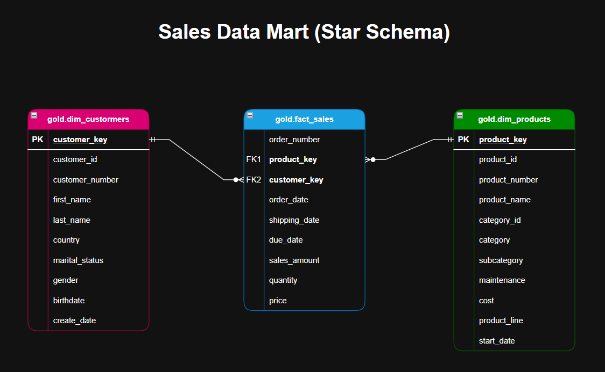

# Data Warehouse Analytics Project

------------------------------------------------------------------------

## 📌 Project Overview

This project is a structured, production-style SQL analytics
implementation designed to simulate a real-world Business Intelligence
environment.

It demonstrates the ability to:

-   Design a clean analytical data model\
-   Enforce data integrity constraints\
-   Apply financial precision best practices\
-   Build scalable analytical queries\
-   Deliver BI-ready reporting views

The objective is to move beyond isolated SQL queries and showcase
end-to-end analytical system design.

------------------------------------------------------------------------

## 🏗 Architectural Design

This project operates on a structured Star Schema model consistent with
enterprise Data Warehouse design principles.

It complements a separate Data Warehouse engineering project that
focuses on ingestion, transformation, and modeling.

👉 [SQL Server Data Warehouse Project](../01_Data_Warehouse/SQL_Server)

Together, they simulate a complete BI pipeline from raw data ingestion
to advanced analytical reporting.

### Data Flow

CSV datasets\
→ Structured SQL tables\
→ Star Schema (Gold Layer)\
→ Analytical Queries\
→ Reporting Views (BI-ready)

The architecture is intentionally streamlined to focus on:

-   Data modeling best practices\
-   Referential integrity enforcement\
-   Financial data precision\
-   Analytical scalability\
-   Business-oriented reporting

------------------------------------------------------------------------

## ⭐ Data Model -- Star Schema

### Dimension Tables

-   `gold.dim_customers`
-   `gold.dim_products`

### Fact Table

-   `gold.fact_sales`

### Data Integrity & Reliability

-   Primary Keys enforced
-   Foreign Keys enforced
-   Explicit numeric typing using `DECIMAL`
-   Controlled NULL handling
-   Deterministic window frame definitions

The model follows standard BI principles to ensure analytical
consistency and scalability.

------------------------------------------------------------------------

## 📂 Project Structure

    dataset/
    ├── gold.dim_customers.csv
    ├── gold.dim_products.csv
    ├── gold.fact_sales.csv

    scripts/
    ├── 00_init_database/
    │   ├── 01_create_database_and_schemas.sql
    │   ├── 02_create_tables_gold_and_stage.sql
    │   ├── 03_load_stage_then_gold.sql
    │
    ├── 01_analytics/
    │   ├── 01_database_exploration.sql
    │   ├── 02_dimensions_exploration.sql
    │   ├── 03_date_range_exploration.sql
    │   ├── 04_measures_exploration.sql
    │   ├── 05_magnitude_analysis.sql
    │   ├── 06_ranking_analysis.sql
    │   ├── 07_change_over_time_analysis.sql
    │   ├── 08_cumulative_analysis.sql
    │   ├── 09_performance_analysis.sql
    │   ├── 10_data_segmentation.sql
    │   ├── 11_part_to_whole_analysis.sql
    │   ├── 12_report_customers.sql
    │   ├── 13_report_products.sql

The structure separates:

-   Database initialization\
-   Data loading\
-   Analytical logic\
-   Reporting layer

This modular organization improves maintainability and clarity.

------------------------------------------------------------------------

## 📊 Analytical Progression

### 1️⃣ Exploration

-   Database structure inspection\
-   Dimension value validation\
-   Date coverage analysis\
-   Core KPI calculation

### 2️⃣ Aggregation & Distribution

-   Revenue magnitude analysis\
-   Contribution and share analysis\
-   Ranking (Top / Bottom entities)

### 3️⃣ Time-Series Analysis

-   Monthly aggregation\
-   Running totals\
-   Moving averages\
-   Month-over-Month growth\
-   Year-over-Year growth

### 4️⃣ Segmentation & Business Logic

-   Cost segmentation\
-   Customer segmentation (VIP / Regular / New)\
-   Product segmentation\

### 5️⃣ Reporting Views

-   `gold.report_customers`
-   `gold.report_products`

These views consolidate business KPIs and are directly consumable by BI
tools such as Power BI.

------------------------------------------------------------------------

## 📈 Advanced SQL Techniques Used

-   Window Functions:
    -   `SUM() OVER()`
    -   `AVG() OVER()`
    -   `LAG()`
-   Explicit window frame definitions (`ROWS BETWEEN`)
-   Running totals and cumulative percentages
-   Weighted averages (weighted by quantity sold)
-   Robust NULL handling
-   Safe division using `NULLIF()`
-   Integer division protection via explicit casting
-   Financial precision management using `DECIMAL`
-   Lifespan and recency calculations

------------------------------------------------------------------------

## 💡 Key Engineering Decisions

-   Financial metrics use `DECIMAL` instead of `FLOAT`
-   Weighted averages replace simple averages when financially required
-   Explicit casting prevents integer division errors
-   Window frames are explicitly defined for deterministic results
-   Segmentation logic is scalable and modular
-   Queries are organized by analytical theme

The design prioritizes correctness, clarity, and production-style
reliability.

------------------------------------------------------------------------

## 🎯 Skills Demonstrated

-   Data Warehouse Modeling (Star Schema)
-   SQL Server schema design
-   ETL process using `BULK INSERT`
-   Analytical SQL development
-   Advanced window functions mastery
-   Time-series analysis
-   KPI engineering
-   Business-driven data segmentation
-   Performance-oriented query structuring
-   Production-ready reporting layer design
