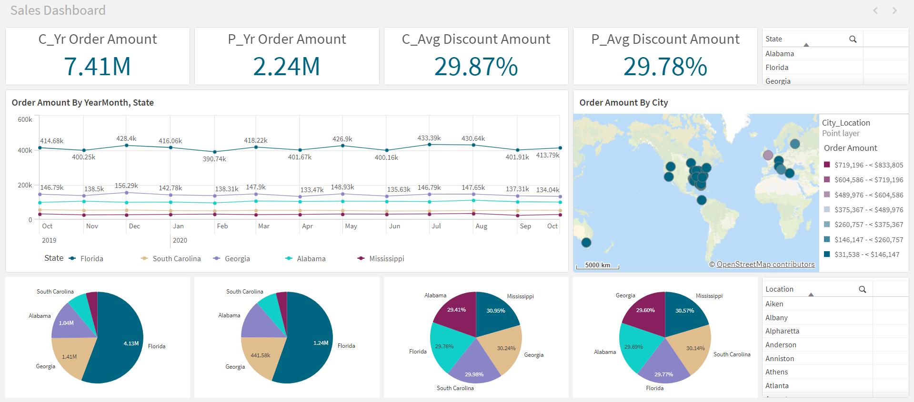

# Retail Transactions Dashboard --- Qlik Sense

Interactive **Sales Analytics Dashboard** built with **Qlik Sense**
using a retail transaction dataset.

This lightweight project demonstrates how transactional data can quickly
be transformed into an interactive dashboard for **sales monitoring and
geographic analysis**.

------------------------------------------------------------------------

# Dashboard Preview



The dashboard provides a clear overview of retail performance through:

-   KPI indicators
-   monthly sales trends
-   geographic sales distribution
-   state contribution
-   discount comparison

------------------------------------------------------------------------

# Dataset

| File | Description |
|------|-------------|
| `Retail Transactions.csv` | Retail transaction dataset containing order amount, discount, city, state and date information |

Each row represents **one sales transaction**.

------------------------------------------------------------------------

# Key Metrics

| KPI | Description |
|-----|-------------|
| C_Yr Order Amount | Total order amount for the current year |
| P_Yr Order Amount | Total order amount for the previous year |
| C_Avg Discount Amount | Average discount applied during the current year |
| P_Avg Discount Amount | Average discount applied during the previous year |

These KPIs allow quick **year‑over‑year comparison of sales and discount behavior**.

------------------------------------------------------------------------

# Main Visualizations

| Visualization | Purpose |
|---------------|---------|
| Sales trend by YearMonth | Identify seasonal patterns |
| Sales by city map | Geographic distribution of orders |
| Sales contribution by state | Compare state performance |
| Discount comparison | Evaluate pricing strategy impact |

------------------------------------------------------------------------

# Filters

The dashboard includes interactive filters for:

-   **State**
-   **City**

This allows users to explore **local market performance**.

------------------------------------------------------------------------

# Repository Structure

``` text
.
├── README.md
├── dashboard/
│   └── retail_dashboard.png
├── app/
│   └── retail_transactions.qvf
└── datasets/
    └── Retail Transactions.csv
```

------------------------------------------------------------------------

# Skills Demonstrated

-   Qlik Sense dashboard development
-   KPI design
-   sales trend analysis
-   geographic data visualization
-   business analytics storytelling

------------------------------------------------------------------------

# Author

**Farius Aina**\
Data Analytics & Decision Support
