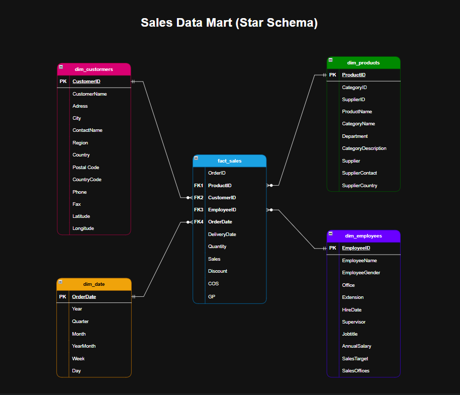
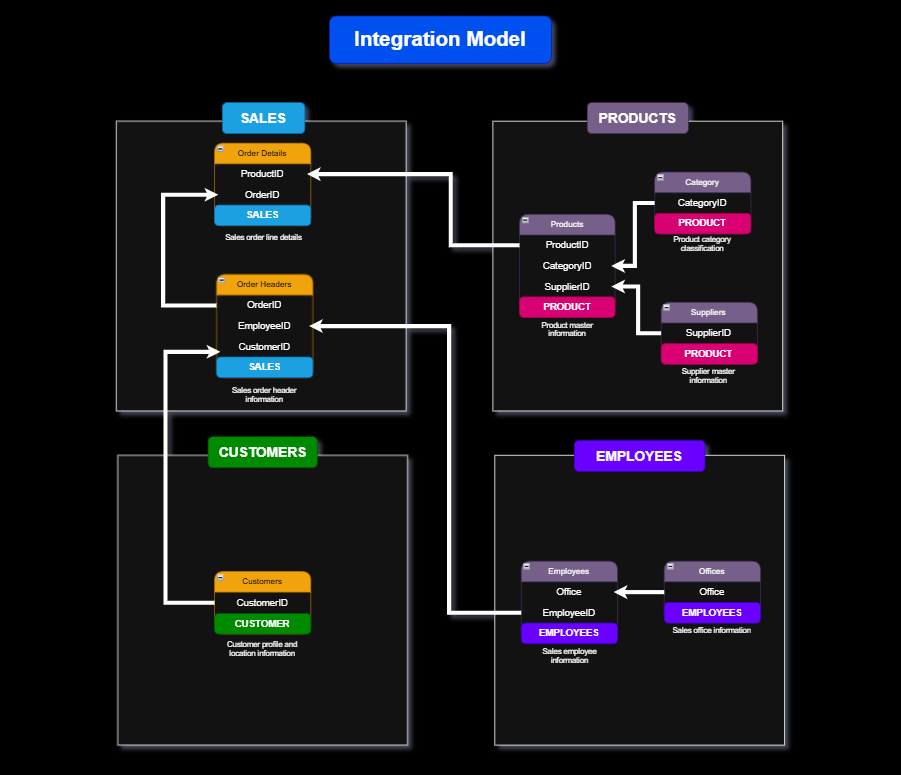
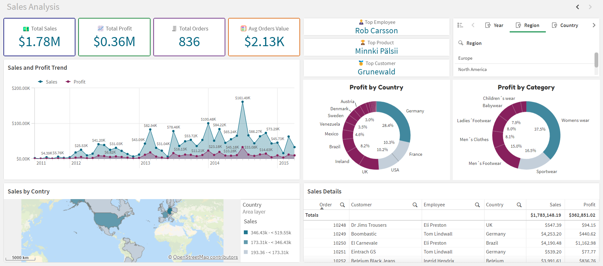
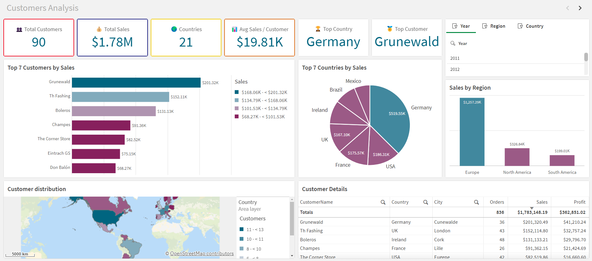
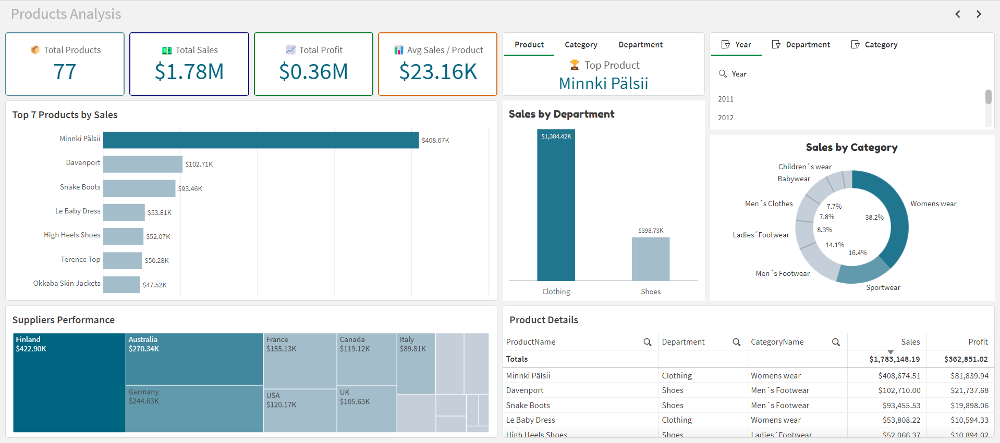
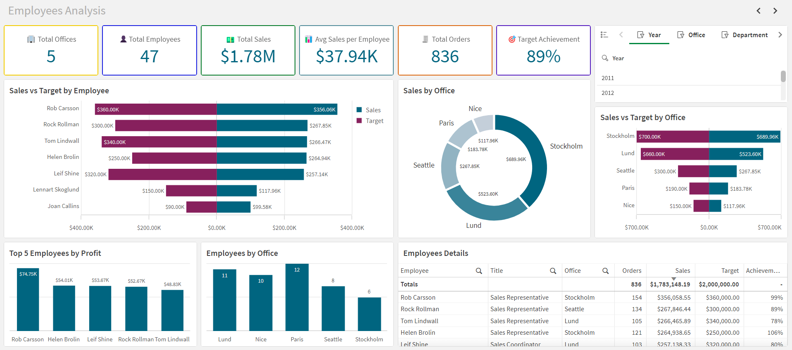

# Qlik Sense Sales Dashboard

An end-to-end **Qlik Sense analytics project** built on a retail sales dataset and modeled as a **Star Schema data mart** for business intelligence reporting.

This project transforms raw Excel source tables into a clean analytical layer and delivers four interactive dashboards focused on:

- Sales analysis
- Customers analysis
- Products analysis
- Employees analysis

---

## Project Highlights

- **BI Tool:** Qlik Sense
- **Data Modeling:** Star Schema
- **Source Format:** Excel
- **ETL Logic:** Modular Qlik Script (`.qvs`)
- **Analytical Scope:** Sales, customers, products, employees
- **Portfolio Goal:** Business-oriented dashboarding with a structured semantic layer

---

## Business Objective

The goal of this project is to design a **reusable analytics solution** that helps stakeholders monitor commercial performance from multiple perspectives:

- overall sales performance
- customer contribution
- product/category performance
- employee and office productivity
- time-based business trends

---

## Data Source

The project uses a retail dataset stored in:

```text
datasets/store_sales.xlsx
```

The source includes the following business entities:

| Source Table | Description |
|--------------|-------------|
| `Customers` | Customer profile and geographic information |
| `Employees` | Employee master data and targets |
| `Offices` | Sales office mapping |
| `OrderHeader` | Order-level commercial data |
| `OrderDetails` | Product-level transaction lines |
| `Products` | Product master data |
| `Category` | Product category reference |
| `Suppliers` | Supplier reference data |

---

## Data Model

The analytical model is built as a **Star Schema** with one central fact table and four dimensions.

### Star Schema



### Integration Model



---

## Final Analytical Tables

| Table | Role | Business Grain |
|-------|------|----------------|
| `fact_sales` | Central fact table | One row per `OrderID` + `ProductID` |
| `dim_customers` | Customer dimension | One row per customer |
| `dim_products` | Product dimension | One row per product |
| `dim_employees` | Employee dimension | One row per employee |
| `dim_date` | Calendar dimension | One row per date |

---

## ETL Pipeline

The project follows a modular Qlik scripting workflow.

| Script | Purpose |
|--------|---------|
| `01_raw_tables.qvs` | Load raw source tables from Excel |
| `02_dimensions_tables.qvs` | Build dimension tables |
| `03_fact_sales.qvs` | Build the fact table from order lines |
| `04_date_dimension.qvs` | Generate the calendar dimension |
| `05_drop_raw_tables.qvs` | Drop staging/raw tables |

### Transformation Logic

#### 1. Raw ingestion
Source tables are loaded from the Excel workbook into Qlik staging tables.

#### 2. Dimension building
Three descriptive dimensions are created:

- `dim_customers`
- `dim_products`
- `dim_employees`

#### 3. Fact construction
`fact_sales` is created from `OrderDetails`, then enriched with order header attributes through a left join on `OrderID`.

```qvs
NoConcatenate
fact_sales:
LOAD
    OrderID,
    ProductID,
    Quantity,
    Sales,
    Discount,
    COS,
    GP
RESIDENT OrderDetails;

LEFT JOIN (fact_sales)
LOAD
    OrderID,
    CustomerID,
    EmployeeID,
    OrderDate,
    DeliveryDate
RESIDENT OrderHeader;
```

#### 4. Calendar generation

The date dimension `dim_date` is generated dynamically from the minimum and maximum `OrderDate` present in `fact_sales`.

---

## Dashboards

## 1) Sales Analysis



**Main focus**
- overall revenue and profit
- sales trend over time
- sales and profit by geography
- detailed order exploration

**Examples of KPIs**
- Total Sales
- Total Profit
- Total Orders
- Average Order Value
- Top Employee
- Top Product
- Top Customer

---

## 2) Customers Analysis



**Main focus**
- customer contribution to revenue
- top customers and countries
- geographic customer distribution
- region-based analysis

**Examples of KPIs**
- Total Customers
- Total Sales
- Countries Covered
- Average Sales per Customer
- Top Country
- Top Customer

---

## 3) Products Analysis



**Main focus**
- product sales ranking
- category contribution
- department performance
- supplier-driven analysis

**Examples of KPIs**
- Total Products
- Total Sales
- Total Profit
- Average Sales per Product
- Top Product
- Top Category
- Top Department

---

## 4) Employees Analysis



**Main focus**
- sales versus targets
- employee profitability
- office performance
- workforce distribution by office

**Examples of KPIs**
- Total Offices
- Total Employees
- Total Sales
- Average Sales per Employee
- Total Orders
- Target Achievement

---

## Key Analytical Features

- interactive filters by year, country, region, office, department, and category
- KPI cards for executive summaries
- ranking visuals for top contributors
- geographical maps for customer and sales distribution
- comparative charts for target achievement
- detailed tables for drill-down analysis

---

## Repository Structure

```text
.
├── README.md                  # Project overview and documentation

├── app/                       # Qlik Sense application
│   └── store_sales_dashboard.qvf

├── datasets/                  # Raw dataset used in the project
│   └── store_sales.xlsx

├── dashboards/                # Dashboard screenshots used in the README
│   ├── sales_dashboard.png
│   ├── customers_dashboard.png
│   ├── products_dashboard.png
│   └── employees_dashboard.png

├── docs/                      # Project documentation
│   ├── data_catalog.md
│   ├── architecture.png
│   ├── data_flow.png
│   ├── data_integration.png
│   └── data_model.png

├── model/                     # Data modeling diagrams
│   ├── star_schema.png
│   └── integration_model.png

└── scripts/                   # Qlik Sense ETL scripts
    ├── 01_raw_tables.qvs
    ├── 02_dimensions_tables.qvs
    ├── 03_fact_sales.qvs
    ├── 04_date_dimension.qvs
    └── 05_drop_raw_tables.qvs
```

---

## Skills Demonstrated

- dashboard design in Qlik Sense
- dimensional modeling
- business KPI engineering
- Qlik script ETL
- analytical storytelling
- business performance analysis
- semantic layer design for BI tools

---

## Related Documentation

- `data_catalog.md` -- detailed analytical table documentation
- `.qvs` scripts -- transformation logic
- dashboard screenshots -- final reporting outputs

---

## Author

**Farius Aina**  
Data Analytics & Decision Support
