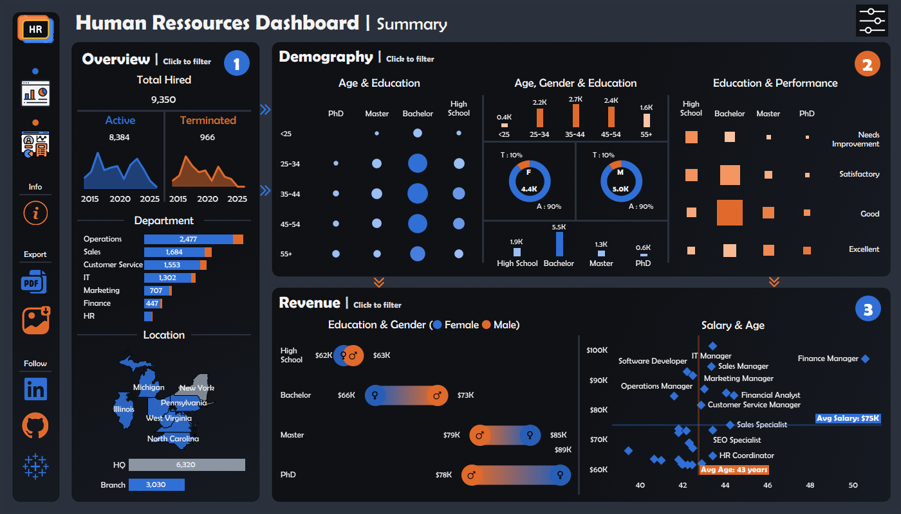
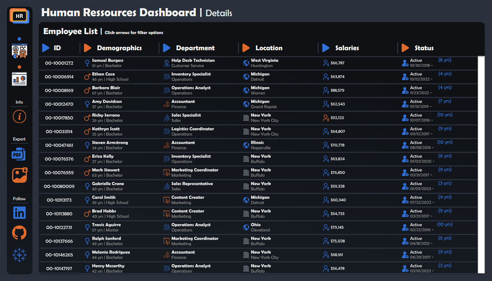

# Human Resources Dashboard (Tableau)

An end-to-end **HR analytics dashboard** built in Tableau to explore workforce structure, demographic composition, and compensation patterns using a synthetic employee dataset.

The solution delivers an interactive decision-support interface designed to analyze:

- workforce size and employment status
- department distribution
- demographic segmentation
- education and performance relationships
- salary structure across roles and experience levels
- geographic workforce footprint

---

# Project Preview

## Animated Preview

## Summary Dashboard

## Details Dashboard

The project includes two analytical views:

- Summary Dashboard (organizational insights)
- Details Dashboard (employee-level exploration)

---

# Project Highlights

- **BI Tool:** Tableau
- **Dataset Type:** Synthetic HR dataset
- **Source Format:** CSV
- **Data Structure:** Flat analytical dataset
- **Scope:** Workforce, demographics, compensation
- **Portfolio Goal:** Decision-support dashboard design

---

# Business Objective

The objective of this project is to design an interactive HR analytics dashboard supporting workforce exploration from strategic and operational perspectives.

The dashboards help answer questions such as:

- How is the workforce distributed across departments?
- What demographic patterns structure the organization?
- How does education relate to performance?
- How does salary evolve across job roles and experience levels?
- Are there compensation differences across education levels?
- How is the workforce geographically distributed?

---

# Dataset

The dashboard uses a single synthetic dataset located in:

dataset/hr_dataset.csv

The dataset contains employee-level records describing:

- demographics
- department and job role
- geographic location
- salary
- hiring and termination status
- employment tenure

See:

docs/data_catalog.md

for full dataset documentation.

---

# Dashboard Structure

The analytics flow is organized as a guided exploration:

### ① Workforce Overview

Provides high-level organizational indicators:

- total employees hired
- active vs terminated employees
- department distribution
- geographic presence

Supports structural workforce analysis.

### ② Demographic Analysis

Explores workforce composition across:

- age groups
- gender distribution
- education levels
- performance categories

Supports population-level segmentation analysis.

### ③ Compensation Insights

Analyzes salary patterns across:

- education levels
- gender
- job roles
- employee age

Supports compensation structure interpretation.

### Details View (Employee Exploration)

Provides record-level filtering capabilities across:

- department
- demographics
- location
- salary range
- employment status
- tenure

Supports targeted workforce segmentation.

---

# Key Analytical Features

- guided dashboard navigation (① ② ③ workflow)
- cross-chart filtering interactions
- demographic segmentation analysis
- education vs performance comparison
- salary vs age distribution analysis
- department-level workforce structure
- geographic workforce visualization
- employee-level filtering interface

---

# Key Insights Extracted from the Dashboard

The dashboard enables exploration of workforce structure, demographic composition, and compensation distribution across the organization.

### Workforce Structure

- Operations represents the largest department in the organization, followed by Sales and Customer Service.
- HR and Finance remain smaller functional units compared to operational departments.
- The workforce is primarily concentrated in headquarters rather than branch locations.

### Demographic Composition

- Employees aged **35–44** represent the largest share of the workforce.
- Bachelor’s degree holders form the dominant education group across departments.
- Gender distribution remains relatively balanced across the organization.

### Education & Performance Relationship

- Employees with Bachelor’s degrees show strong representation across **Good** performance ratings.
- Higher education levels (Master / PhD) are associated with increased representation in **Excellent** performance categories.
- High School education levels appear more frequently in **Needs Improvement** segments.

### Compensation Structure

- Salary levels increase progressively with higher education attainment.
- Master’s and PhD holders show the highest average salary ranges.
- Mid-career employees (ages 35–45) cluster around the organization’s average salary band.

### Role-Based Salary Distribution

- Finance Manager and IT Manager roles appear among the highest compensated positions.
- Operational support roles show lower but stable salary ranges.
- Sales and marketing positions display wider compensation variability.

### Workforce Tenure Patterns

- A significant portion of employees fall within the **3–10 years tenure range**, indicating moderate organizational stability.
- Long-tenure employees (>10 years) are present across multiple departments rather than concentrated in one function.

---

# Potential Business Use Cases

This dashboard can support HR teams, managers, and decision-makers in exploring workforce structure and compensation dynamics across the organization.

### Workforce Planning

Identify how employees are distributed across departments and locations to support hiring strategy and organizational balancing.

Example questions:

- Which departments are growing fastest?
- Where is workforce concentration highest?
- Which areas may require reinforcement?

### Attrition Monitoring

Analyze active vs terminated employee patterns to detect structural turnover risks across departments or demographic groups.

Example questions:

- Which departments show higher termination ratios?
- Are certain tenure ranges associated with higher attrition?
- Are younger employees leaving more frequently?

### Compensation Structure Analysis

Evaluate how salary varies across roles, education levels, and employee age groups to support compensation benchmarking.

Example questions:

- Does education level influence salary distribution?
- Which roles show the widest compensation variability?
- Are salary levels aligned across departments?

### Diversity & Inclusion Monitoring

Support gender and education-level distribution analysis to better understand workforce composition.

Example questions:

- Is gender representation balanced across departments?
- Are leadership roles evenly distributed across demographics?
- Are performance ratings evenly distributed across groups?

### Performance Segmentation

Explore relationships between education level and performance ratings to identify workforce development opportunities.

Example questions:

- Which education profiles are associated with stronger performance outcomes?
- Are training programs needed for specific employee segments?

### Tenure-Based Workforce Stability Analysis

Understand employee retention patterns by analyzing employment duration across departments and job roles.

Example questions:

- Which departments retain employees longer?
- Are short-tenure employees concentrated in specific roles?
- Where might onboarding improvements reduce early exits?

---

# Analytical Design Approach

This dashboard follows a decision-support analytics structure:

- Overview → organizational structure
- Demographics → workforce composition
- Compensation → salary insights
- Details → employee-level exploration

The layout guides users progressively from strategic indicators to operational investigation.

---

# Data Generation Note

The dataset used in this project is synthetic and generated using:

- ChatGPT
- Faker library

It is designed to simulate realistic HR analytics scenarios.

---

# Inspiration

This dashboard is inspired by the HR Analytics project by **DatawithBaara**.

This version extends the original concept with:

- updated dataset structure
- redesigned interaction flow
- guided analytical navigation
- customized visual identity aligned with portfolio theme

---

# Skills Demonstrated

This project highlights practical analytics and BI capabilities:

- Tableau dashboard development
- HR analytics exploration
- KPI structuring
- dashboard interaction design
- analytical storytelling
- workforce segmentation analysis
- compensation pattern interpretation
- decision-support dashboard architecture

---

# Repository Structure

├── README.md
├── hr_dashboard.twbx
├── dataset/
│   └── hr_dataset.csv
├── dashboards/
│   ├── hr_dashboard.gif
│   ├── hr_summary_dashboard.png
│   ├── hr_summary_dashboard+filter.png
│   ├── hr_summary_background.png
│   ├── hr_details_background.png
│   ├── hr_details_dashboard.png
│   └── hr_details_dashboard+filter.png
├── docs/
│   └── hr_data_catalog.md

---

# Related Documentation

docs/data_catalog.md

Contains dataset structure and column-level documentation.

---

# Author

**Farius Aina**  
Data Analytics & Decision Support
