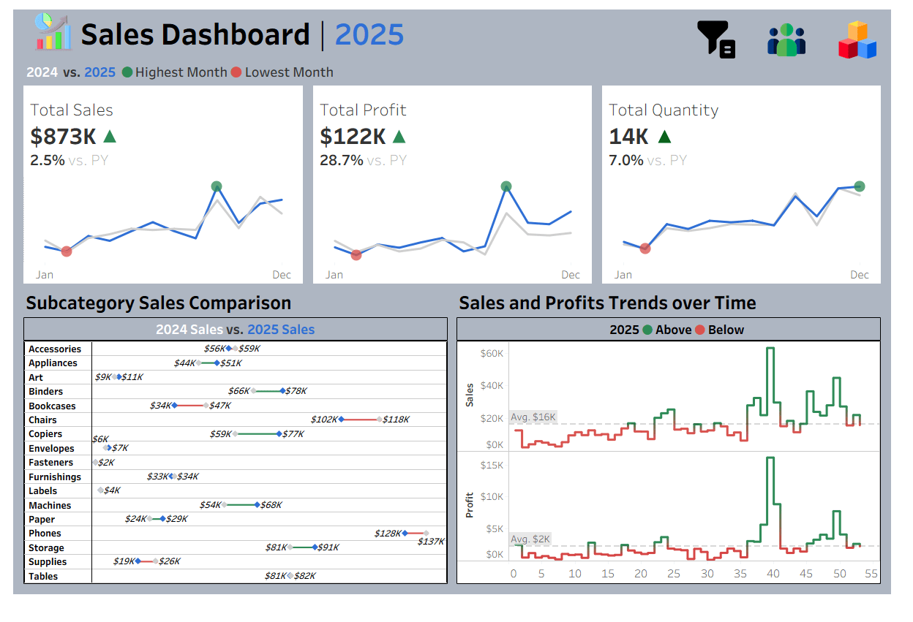
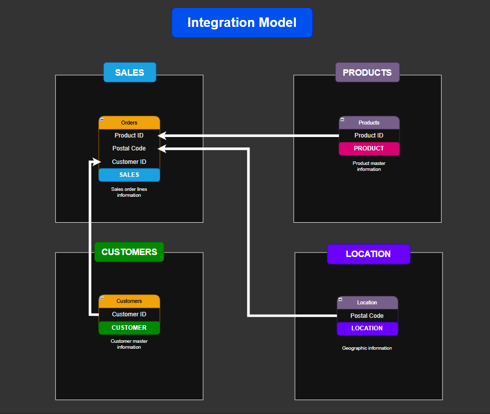
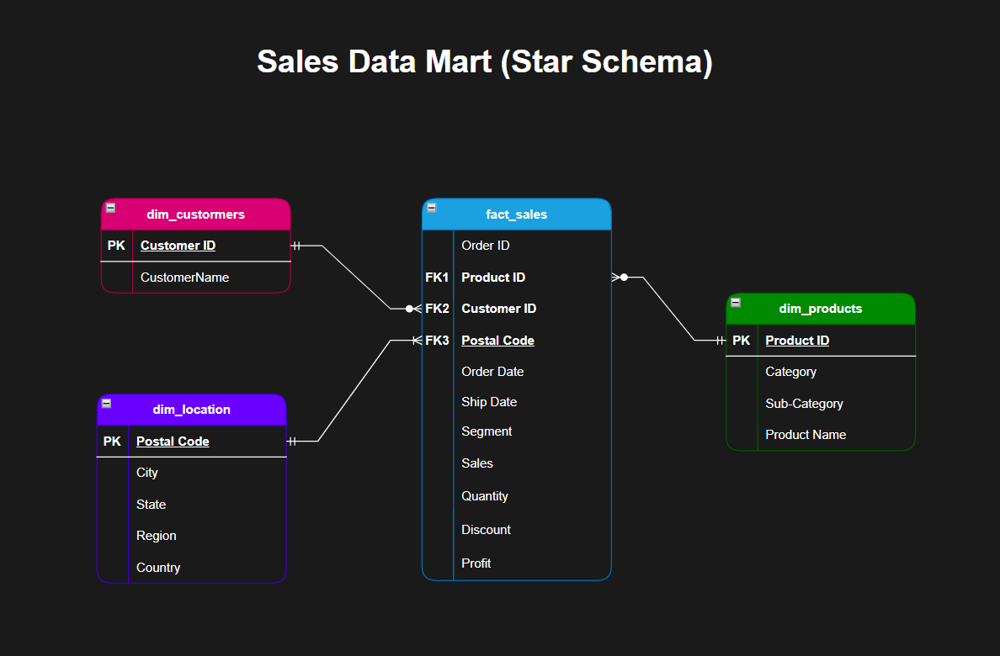
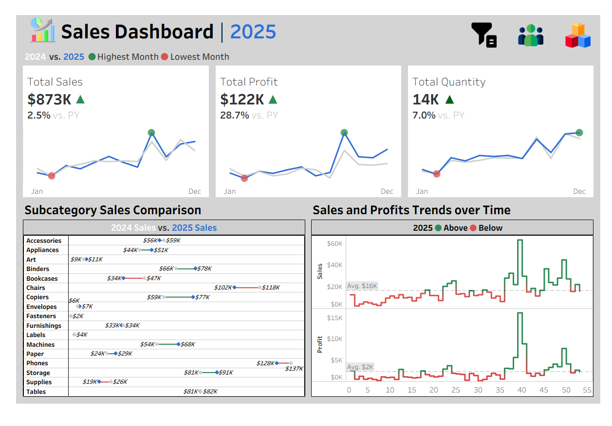
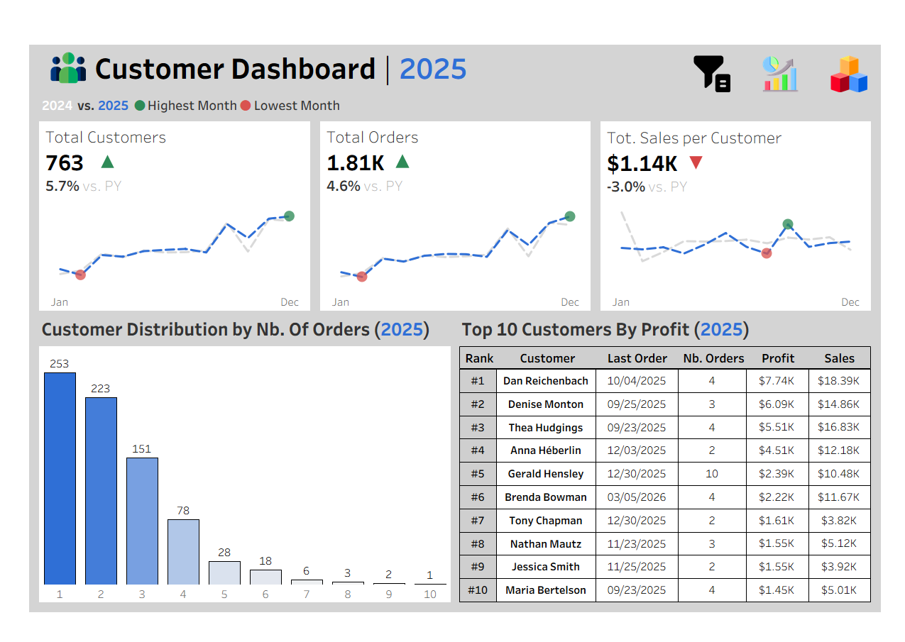
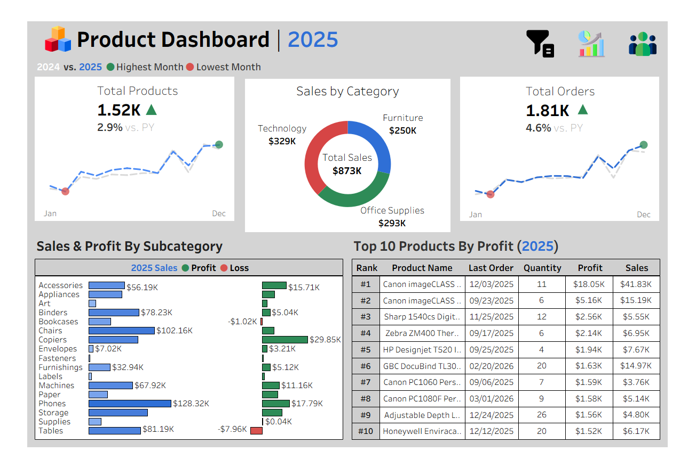

# Tableau Sales Dashboard

An end-to-end **Tableau analytics project** built on a structured retail dataset and modeled as a **star schema data mart** for business intelligence reporting.

The solution delivers interactive dashboards designed to support decision-making across:

- sales performance monitoring
- customer behavior analysis
- product performance evaluation
- geographic distribution insights

---

# Project Preview



The project includes three analytical dashboards:

- Sales Dashboard
- Customer Dashboard
- Product Dashboard

---

# Project Highlights

- **BI Tool:** Tableau
- **Data Modeling:** Star Schema
- **Source Format:** CSV
- **Grain:** Order line level (`Order ID + Product ID`)
- **Scope:** Sales, customers, products, geography
- **Portfolio Goal:** Business-oriented dashboarding with semantic modeling

---

# Business Objective

The objective of this project is to design a reusable analytics solution enabling stakeholders to monitor commercial performance from multiple perspectives.

The dashboards help answer questions such as:

- How are sales evolving compared to last year?
- Which sub-categories generate the most profit?
- Which customers contribute the most revenue?
- Which regions underperform?
- Which products generate losses despite strong sales?
- How does customer ordering behavior evolve over time?

---

# Data Sources

The project uses four CSV datasets located in:

datasets/

| Source File | Description |
|-------------|-------------|
| `Orders.csv` | Transactional sales dataset at order-line level |
| `Customers.csv` | Customer master data |
| `Products.csv` | Product hierarchy |
| `Location.csv` | Geographic reference data |

---

# Data Model

The analytical layer follows a **star schema-inspired structure** centered on the transactional sales table.

### Integration Model



### Star Schema



---

# Final Analytical Tables

| Table | Role | Business Grain |
|------|------|----------------|
| `orders` | Fact table | One row per `Order ID + Product ID` |
| `customers` | Dimension | One row per customer |
| `products` | Dimension | One row per product |
| `location` | Dimension | One row per postal code |

---

# Table Relationships

| Source Table | Target Table | Join Key | Relationship Type |
|--------------|--------------|----------|-------------------|
| `orders` | `customers` | Customer ID | Many-to-one |
| `orders` | `products` | Product ID | Many-to-one |
| `orders` | `location` | Postal Code | Many-to-one |

---

# Dashboards

## 1) Sales Dashboard



**Main focus**

- total sales, profit, and quantity tracking
- monthly comparison vs previous year
- sub-category sales comparison
- trend analysis over time

**Example KPIs**

- Total Sales
- Total Profit
- Total Quantity
- Sales vs Previous Year
- Profit vs Previous Year

---

## 2) Customer Dashboard



**Main focus**

- customer acquisition and activity tracking
- order distribution analysis
- customer profitability ranking

**Example KPIs**

- Total Customers
- Total Orders
- Average Sales per Customer
- Top 10 Customers by Profit

---

## 3) Product Dashboard



**Main focus**

- category contribution analysis
- sub-category profitability tracking
- product ranking

**Example KPIs**

- Total Products
- Sales by Category
- Sales & Profit by Sub-Category
- Top 10 Products by Profit

---

# Key Analytical Features

- dynamic year filtering
- category and sub-category filtering
- regional filtering
- KPI comparison vs previous year
- ranking tables (Top N customers/products)
- profit vs loss detection by sub-category
- customer behavior distribution analysis

---

# Repository Structure

```text
├── README.md
├── Sales Data Dashboard.twbx
├── datasets/
│   ├── Orders.csv
│   ├── Customers.csv
│   ├── Products.csv
│   └── Location.csv
├── dashboards/
│   ├── sales_dashboard.png
│   ├── customer_dashboard.png
│   └── product_dashboard.png
├── docs/
│   └── data_catalog.md
└── model/
    ├── integration_model.png
    └── star_schema.png
```

---

# Skills Demonstrated

This project highlights practical BI engineering capabilities:

- Tableau dashboard development
- dimensional modeling (star schema)
- KPI engineering
- business performance analysis
- customer analytics
- product analytics
- geographic reporting
- analytical storytelling

---

# Related Documentation

- `docs/data_catalog.md` | detailed analytical table documentation
- `model/` | semantic data model diagrams
- `dashboards/` | dashboard screenshots
- `.twbx` | packaged Tableau workbook

---

# Author

**Farius Aina**  
Data Analytics & Decision Support
