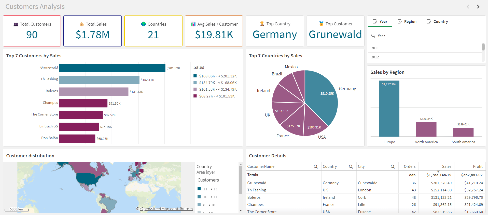

# Data Analytics & Decision Support Portfolio

This repository presents a structured collection of applied analytics projects designed to transform raw data into decision-ready business insights.

The portfolio covers:

- Data Warehouse Architecture
- Power BI Reporting
- SQL Analytics
- Python Analytics
- Qlik Sense Dashboards
- Tableau Dashboards

Each project demonstrates production-style analytics workflows combining modeling, transformation, and visualization.

---

# Portfolio Structure

01_Data_Warehouse/\
02_PowerBI_Dashboards/\
03_SQL_Analytics/\
04_Python_Analytics/\
05_Qlik_Sense_Dashboards/\
06_Tableau/

---

# 1. Data Warehouse Architecture

Bronze → Silver → Gold layered architecture implemented for scalable analytics environments.

Highlights:

- layered warehouse modeling
- star schema semantic layer
- SQL Server & Snowflake implementations
- ETL reproducibility
- analytics-ready structures

---

# 2. Power BI Dashboards

Interactive KPI dashboards supporting operational and financial monitoring.

Highlights:

- executive KPI cards
- category performance tracking
- trend analysis
- business storytelling dashboards
- decision-support reporting

---

# 3. SQL Analytics

Exploratory analytics workflows built directly on dimensional warehouse models.

Highlights:

- KPI engineering in SQL
- ranking logic
- window functions
- cumulative metrics
- YoY comparisons

---

# 4. Python Analytics

Applied analytical notebooks supporting structured dataset exploration.

Highlights:

- dataset profiling
- statistical summaries
- feature-level analysis
- analytical workflows

---

# 5. Qlik Sense Dashboards

End-to-end BI applications built with scripted ETL and semantic modeling layers.

Highlights:

- star schema modeling
- QVS ETL pipelines
- KPI dashboards
- customer analytics
- employee performance tracking

---

# 6. Tableau Dashboards

Interactive dashboards built on a structured sales data mart.

Highlights:

- star schema analytical model
- KPI comparison vs previous year
- product profitability analysis
- customer ordering behavior insights
- geographic performance tracking

Includes:

- integration model
- star schema documentation
- analytical data catalog
- packaged workbook (.twbx)

---

# Core Competencies Demonstrated

- Dimensional Modeling (Star Schema)
- KPI Engineering
- SQL Analytics
- Tableau Dashboarding
- Power BI Reporting
- Qlik Sense Development
- Data Warehouse Design
- Snowflake & SQL Server
- Python Analytics Workflows
- Business Performance Analysis

---

# Continuous Development

Additional structured learning projects and technical explorations are
available in:

👉 https://github.com/Farius0/Formation_Ligne

---

# Certifications & Professional Credentials

## Data Analytics

- Google Data Analytics Professional Certificate

## Cloud & AI Foundations

- Microsoft Azure AZ-900 (Fundamentals)
- PL-300 (Power BI Data Analyst Associate -- in progress)

## Programming & Development

- Python Developer Certification
- SQL, Excel, Power BI Certifications

Verified credentials and official transcripts:
- [Coursera](https://www.coursera.org/account/accomplishments/specialization/6VYEFQ18FBXP)  
- [Google Skills](https://www.skills.google/public_profiles/76dbfaca-d7cf-48d5-bc8e-22374b0538f6)  
- [Microsoft Learn](https://learn.microsoft.com/fr-fr/users/fariusaina-8780/transcript/dw2g1i62wmn5rn2)  
- [Credly](https://www.credly.com/users/farius-aina)

---

# Contact

- Professional website: [Link](https://fariusaina.com) 
- LinkedIn: [Farius Aina](https://linkedin.com/in/farius-a-716b69244)

---

⭐ This portfolio reflects a structured approach to analytics engineering, BI reporting, and decision-support system design.
